# Руководство для управления приложением `youtrade.cs` (Lis → TM)
Добро пожаловать! Это руководство — не просто мануал по командам, а ключ к тому, чтобы понять, как работает парсер и сам бот. Обязательно ознакомьтесь с ним, чтобы получить максимальную выгоду и уверенность в его использовании!

- [КАК РАБОТАЕТ БОТ АВТОПОКУПКИ](#как-работает-бот-автопокупки)
  - [Настройка фильтров для поиска предметов](#настройка-фильтров-для-поиска-предметов)
  - [Список команд](#список-команд)
    - [Запрос доступа для роли FULL](#запрос-доступа-для-роли-full)
    - [Заполнение обязательных полей](#заполнение-обязательных-полей)
    - [Добавление исключаемых слов](#добавление-исключаемых-слов)
    - [Добавление слов в белый список](#добавление-слов-в-белый-список)
    - [Выбор функции корректировки автопокупки](#выбор-функции-корректировки-автопокупки)
    - [Выбор режима дублирования покупок](#выбор-режима-дублирования-покупок)
    - [Определение причин медленной закупки](#определение-причин-медленной-закупки)
    - [Удаление данных о неудачных закупках](#удаление-данных-о-неудачных-закупках)
    - [Добавление API-ключей Lis-Skins](#добавление-api-ключей-lis-skins)
- [КАК РАБОТАЕТ БОТ АВТОПРОДАЖИ](#как-работает-бот-автопродажи)
  - [Заполнение обязательных полей](#заполнение-обязательных-полей-1)
  - [Просмотр списка предметов на автопродаже](#просмотр-списка-предметов-на-автопродаже)
  - [Добавление API-ключей Market.CS](#добавление-api-ключей-marketcs)
- [КАК РАБОТАЕТ ПАРСЕР](#как-работает-парсер)
  - [По уровню риска](#по-уровню-риска)
  - [По ценовым категориям](#по-ценовым-категориям)
  - [По типам оружия](#по-типам-оружия)
  - [По уровню прибыли](#по-уровню-прибыли)
  - [По повторяемости предметов](#по-повторяемости-предметов)
- [ФИНАЛЬНАЯ АКТИВАЦИЯ](#финальная-активация)

## КАК РАБОТАЕТ БОТ АВТОПОКУПКИ

Бот помогает автоматически покупать предметы с площадки Lis-Skins. Он настроен так, чтобы **автоматически, за вас, искать и покупать лучшие предметы быстрее других**, а также **избегать покупок с маленькой выгодой и учитывать риски** — например, как долго нужно ждать предмет или как меняются цены на рынке. Ниже объясняются основные принципы его ее работы.

### Настройка фильтров для поиска предметов

Команды, которые были реализованы в боте помогают вам защитить себя от покупки опасных предметов. Параметры, которые вы можете настроить, включают в себя следующие возможности:

1. Подбор **минимальной** и **максимальной цены** помогает вам подбирать идеальный интервал цены покупки **по цене Lis-Skins**.
2. Выбор **минимальной** и **максимальной популярности** предмета помогает боту выбирать предметы **настолько популярные предметы, насколько часто вам нужно**, чтобы их покупали на Market.CSGO.
3. **Выбор минимального профита** позволяет вам отбирать **предметы с бóльшим профитом**.

    **Осторожно!** Чем выше профит вы ставите, тем реже вы будете покупать предметы. 

    **Профит** считается как отношение **минимального** из: **средней цены** за последний месяц или **текущей цены, к цене покупки на Lis-Skins**, а также **с учетом комиссии в 5% на продажу и 5% на вывод средств**.
4. **Выбор минимального процента автопокупки** для пользователя находится между 80 и 110. **Меньшее значение** процента **означает большую защищенность** от скачков рынка и **большую выгоду** по отношению к таким рынкам как: **BUFF163** и **CS.FLOAT**, потому что трейдеры, закупающие на Market.CSGO часто ориентируются именно на эти рынки при выставлении ордеров.

    **Осторожно!** Чем ниже процент автопокупки - тем реже вы будете покупать предметы.
   
    **Процент автопокупки** считается как отношение цены на **Lis-Skins** к цене **автопокупки на Market.CSGO**.
5. Редактирование значения **максимального количество дней задержки** позволит вам не покупать предметы, которые вы не хотите долго ждать. **Помогает в ситуациях, когда рынок слишком изменчив**, что может вас обезопасить от длинных ожиданий в нежеланное время!

   **Осторожно!** Чем меньше дней задержки вы ставите, тем реже вы будете покупать предметы.
6. **Настройка максимального количества дупликатов** позволяет вам контролировать, **сколько одинаковых предметов бот может приобрести**. Это полезно, если вы хотите избежать избыточного накопления одного типа предметов или, наоборот, сосредоточиться на массовой закупке.

   **Осторожно!** Если установить значение 0, бот полностью исключит возможность покупки одинаковых предметов.
7. **Редактирование коэффициента манипуляции** позволяет боту учитывать резкие колебания цен и **избегать подозрительных предложений**. Этот параметр **помогает минимизировать риск** покупки нестабильных позиций, защищая вас от возможных манипуляций на рынке.

    **Осторожно!** Чем меньше значение коэффициента, тем строже бот будет фильтровать нестабильные предложения, что может сократить количество доступных для покупки предметов.
8. **Определение функции задержки** вкупе с максимальным количеством дней задержки **позволит сгладить временной промежуток до разбана предмета**.

<div style="text-align: center;">
  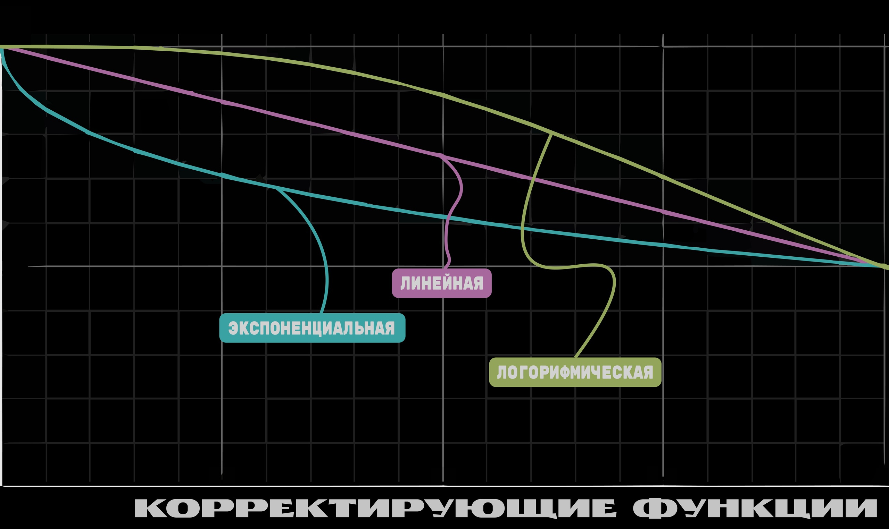
</div>

Корректирующие функции существует несколько видов:

- **Линейная** — параметры **изменяются равномерно**.
- **Экспоненциальная** — **параметры изменяются быстрее** с увеличением значений.
- **Логарифмическая** — изменения происходят **с замедлением**.
- **Прогнозная** — **умная функция**, которая подстраивает параметры на основе анализа рынка, чтобы **предсказать выгодные изменения**.
- Либо **можно вообще не задавать функцию**, если вам такой режим работы не удобен.
  
Использование этих параметров поможет вам сделать работу бота максимально эффективной и настроить его так, чтобы он точно соответствовал вашим ожиданиям. С их помощью бот сможет автоматически находить самые выгодные предложения и обеспечивать стабильный результат на рынке. **Такой подход превращает бота в мощный инструмент для торговли и анализа трендов, экономя ваше время и увеличивая прибыль**.

### Список команд

В этой секции вы найдёте список доступных команд, которые помогут вам настроить и использовать бота для максимальной эффективности. Ознакомьтесь с командами, чтобы лучше понять, как использовать все возможности бота.

#### Запрос доступа для роли FULL
Для получения роли FULL сначала необходимо отправить запрос администратору (в описании бота ссылка на ТГ). Выполните команду:
`/get_sub`

<div style="text-align: center;">
  
</div>

Запрос попадет к администратору, который рассмотрит его и предоставит вам доступ. После подтверждения вы получите все необходимые права для работы с ботом.

<div style="text-align: center;">
  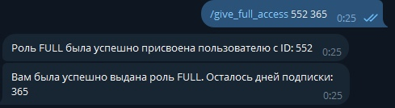
</div>

#### Заполнение обязательных полей

После подтверждения доступа заполните обязательные поля, чтобы бот корректно работал. Выполните команду: `/help_update_autobuy`

<div style="text-align: center;">
  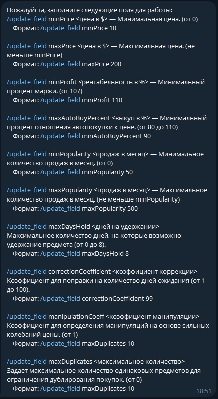
</div>

**Минимальная цена (minPrice)** — Устанавливает минимальную цену предметов для покупки. Уменьшение значения **minPrice** позволяет фокусироваться на более доступных предметах.

```text
/update_field minPrice <цена в $>
Пример: /update_field minPrice 10
```

**Максимальная цена (maxPrice)** — Устанавливает максимальную цену предметов для покупки. Увеличение значения **maxPrice** позволяет фокусироваться на менее доступных предметах.

```text
/update_field maxPrice <цена в $>
Пример: /update_field maxPrice 200
```

**Минимальная рентабельность (minProfit)** — Этот параметр определяет минимальный процент маржи, при котором покупка будет считаться выгодной. **minProfit** зависит от разницы между покупной ценой на Lis-Skins и ценой продажи на Market.CS с учетом всех комиссий. Чем выше значение, тем выше потенциальная прибыль, но тем меньше предложений бот будет рассматривать.

```text
/update_field minProfit <рентабельность в %>
Пример: /update_field minProfit 110
```

**Минимальный процент автопокупки (maxAutoBuyPercent)** — Указывает минимальное соотношение цены на Lis-Skins к цене автопокупки на Market.CS. Чем ниже это значение, тем более рискованные предложения может рассмотреть бот. **НЕ РЕКОМЕНДУЕТСЯ УСТАНАВЛИВАТЬ ЗНАЧЕНИЕ МЕНЬШЕ 97% И БОЛЬШЕ 102%**, если вы не преследуете цель ловли отдельных, определенных редких коэффициентов или предметов. Чем ниже значение, тем более выгодные позиции будет выбирать бот, но тем меньше предложений бот будет рассматривать.

```text
/update_field maxAutoBuyPercent <выкуп в %>
Пример: /update_field maxAutoBuyPercent 97,5
```

**Минимальное количество продаж в месяц (minPopularity)** — Задает минимальное количество продаж в месяц для предмета. Позволяет ограничить покупки менее популярных предметов.
```text
/update_field minPopularity <продаж в месяц>  
Пример: /update_field minPopularity 50
```

**Максимальное количество продаж в месяц (maxPopularity)** — Устанавливает верхний предел популярности для покупок. Этот параметр ограничивает покупку слишком популярных предметов.
```text
/update_field maxPopularity <продаж в месяц> 
Пример: /update_field maxPopularity 500
```
**Максимальное количество дней удержания (maxDaysHold)** — Задает предельное количество дней задержки Lis-Skins перед получением. Этот фильтр позволяет выбирать такие предметы, что они быстрее попадут вам в инвентарь. Допустимое значение — от 0 до 8 дней.
```text
/update_field maxDaysHold <дней на удержании>
Пример: /update_field maxDaysHold 8
```
**Переключить тип функции расчета автопокупки (correctionCoefficient)** — Эта команда позволяет выбрать, как будет изменяться расчет прибыли и автопокупки в зависимости от того, сколько дней нужно ждать. Вы можете настроить, чтобы изменения происходили быстрее или медленнее, в зависимости от вашего выбора.
```text
/update_field correctionCoefficient <коэффициент коррекции>
Пример: /update_field correctionCoefficient 95
```
**Коэффициент манипуляции (manipulationCoeff)** — Используется для оценки подозрительных изменений цены и выявления манипуляций на рынке. Чем выше коэффициент, тем меньше вероятность принятия нестабильных предложений. Диапазон значений: от 1 до 100.
```text
/update_field manipulationCoeff <коэффициент манипуляции> 
Пример: /update_field manipulationCoeff 20
```
**Максимальное количество одинаковых предметов (maxDuplicates)** — Настройка максимального количества дубликатов позволяет **контролировать, сколько одинаковых предметов бот может приобрести — как в абсолютном числе** (например, не более 5 штук одного предмета), так и **в процентном соотношении** (например, не более 10% от количества продаж предмета за месяц). Это помогает избежать переизбытка одного типа лота или, наоборот, сосредоточиться на его массовом скупе.
```text
/update_field maxDuplicates <максимальное количество>
Пример: /update_field maxDuplicates 10
```
**Параметры, настраиваемые вами, распространяются сразу на все аккаунты Lis-Skins, добавляемые вами**. При необходимости, все параметры выставленные вами можно посмотреть, с помощью команды: `/get_parameters`

<div style="text-align: center;">
  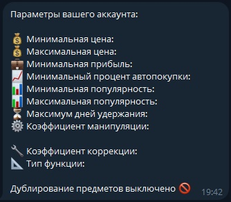
</div>

Таким образом более точная настройка позволит адаптировать бота под те ценовые диапазоны и диапазоны спроса, которые нужны именно вам!

#### Добавление исключаемых слов

При необходимости можно добавить слова, которые бот будет игнорировать при выборе предметов для покупки. Это полезно для исключения нежелательных предметов из списка для покупки. Чтобы добавить исключаемое слово, используйте команду: `/add_excluded_word <слово>`

<div style="text-align: center;">
  
</div> 

Также можно посмотреть все ключевые слова, добавленные вами. Список отобразится после введения команды: `/get_excluded_words`

<div style="text-align: center;">
  
</div> 

При необходимости, можно удалить все ключевые слова, привязанные к аккаунту. Для этого используйте команду: `/remove_excluded_words`

#### Добавление слов в белый список

Вы можете добавить слова, которые бот будет учитывать при выборе предметов для покупки. Это удобно для акцента на конкретных предметах, которые вы хотите приобрести. Чтобы добавить слово в белый список, используйте команду: `/add_included_word <слово>`

<div style="text-align: center;">
  
</div>

Также можно посмотреть все ключевые слова, добавленные вами. Список отобразится после введения команды: `/get_included_words`

<div style="text-align: center;">
  
</div>

При необходимости, можно удалить все ключевые слова, привязанные к аккаунту. Для этого используйте команду: `/remove_included_words`

#### Выбор функции корректировки автопокупки

Команда позволяет переключить тип функции, используемой для расчета параметров автопокупки. `/switch_function_type`

<div style="text-align: center;">
  
</div>

Выберите подходящий вариант для оптимизации работы бота в зависимости от ваших предпочтений:

- **Линейная** — параметры изменяются равномерно.
- **Экспоненциальная** — параметры изменяются быстрее с увеличением значений.
- **Логарифмическая** — изменения происходят с замедлением.
- **Прогнозная** — параметры подстраиваются на основе автоматического анализа рынка.
- **Не задана** — функция не используется, параметры остаются неизменными.

Эта настройка поможет настроить более точный расчет автопокупки в зависимости от ваших нужд.

#### Выбор режима дублирования покупок

Команда позволяет переключить режим, в котором бот ограничивает количество одинаковых предметов при автопокупке. Это влияет на стратегию скупки и помогает лучше контролировать ассортимент.

<div style="text-align: center;">
  
</div>

- **Числовой** — задается максимальное количество копий одного предмета (например, не более 3 штук).
- **Процентный** — указывается доля от общего числа покупок (например, не более 10% на один тип предмета).

#### Определение причин медленной закупки

Вы можете получить список всех неудачных закупок с подробным указанием причин, почему бот не смог завершить покупку. Это поможет вам понять, какие настройки или параметры могут требовать корректировки. Для этого используйте команду: `/get_failed_purchases`

#### Удаление данных о неудачных закупках

Если вам нужно очистить историю неудачных закупок, вы можете удалить все соответствующие записи из базы данных.

**Осторожно!** Действие необратимо. Для этого используйте команду: `/clear_failed_purchases`

#### Добавление API-ключей Lis-Skins

Для начала автопокупок добавьте API-ключ с помощью команды:

```text
/add_lis_token <API_KEY> <TRADE_URL>, где
<API_KEY> — ваш ключ для доступа к Lis-Skins.
<TRADE_URL> — ссылка для торговли на платформе.
```

<div style="text-align: center;">
  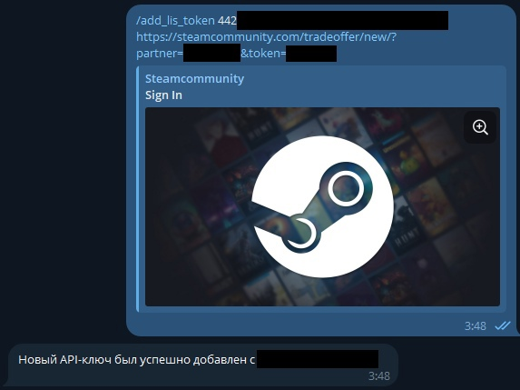
</div>

Данные для заполнения API_KEY и TRADE_URL можно получить, перейдя по данной ссылке: https://lis-skins.ru/profile/api/

<div style="text-align: center;">
  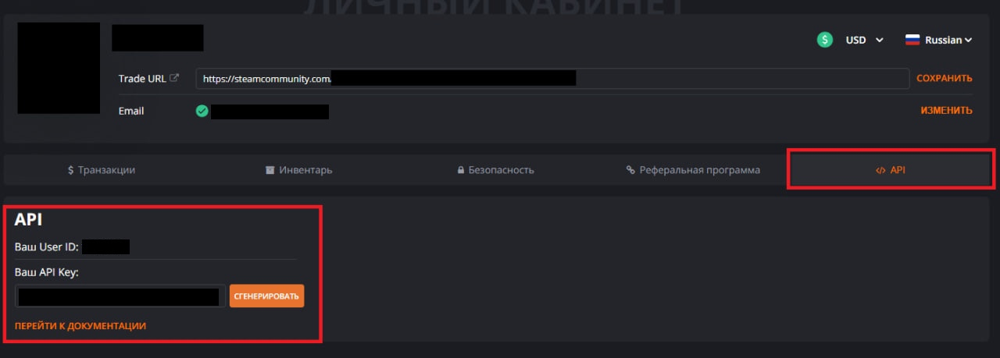
</div>

Чтобы просмотреть список всех добавленных API-ключей, используйте команду: `/get_lis_tokens`

<div style="text-align: center;">
  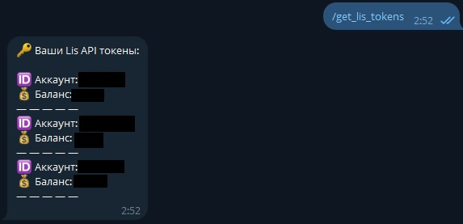
</div>

Если случилось так, что вам нужно удалить токен, то вы можете это сделать с помощью команды: `/remove_token <токен>`.

При необходимости, можно удалить все Lis-Skins аккаунты, привязанные к вашему Telegram. Для этого используйте команду: `/remove_lis_tokens`

Это действие удалит все Lis-Skins аккаунты сразу, будьте внимательны при использовании данной команды!

## КАК РАБОТАЕТ БОТ АВТОПРОДАЖИ

Бот помогает автоматически продавать на площадке Market.CS предметы, купленные ботом. Схема работы представлена ниже:

<div style="text-align: center;">
  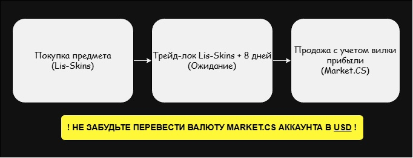
</div>

Он настроен так, чтобы за вас выставлять предметы на продажу с учётом заданной прибыли, рыночной ситуации и времени разблокировки. Бот избегает заниженных цен, учитывает рыночные тренды и помогает продавать быстрее и выгоднее.

### Заполнение обязательных полей

Для корректной работы автопокупки следует настроить поля, указанные в команде: `/help_update_autosell`

<div style="text-align: center;">
  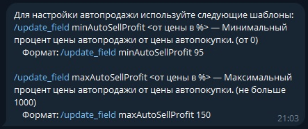
</div>

**Минимальный процент цены автопродажи (minAutoSellProfit)** — Задаёт минимальную прибыль, с которой бот будет выставлять предмет на продажу. **Бот не будет выставлять цену ниже, чем минимальный процент цены автопродажи от цены предмета**.
```text
/update_field minAutoSellProfit <от цены в %>
Пример: /update_field minAutoSellProfit 95
```
**Минимальный процент цены автопродажи (maxAutoSellProfit)** — Ограничивает максимально допустимую прибыль при автоматической продаже. Это полезно для предотвращения выставления предмета по заведомо завышенной цене, которая может отпугнуть покупателей. **Бот не будет выставлять цену выше, чем максимальный процент цены автопродажи от цены предмета**.
```text
/update_field maxAutoSellProfit <от цены в %>
Пример: /update_field maxAutoSellProfit 200
```

### Просмотр списка предметов на автопродаже

**Команда показывает все предметы, которые бот уже выставил на продажу**. Для каждого предмета отображаются его название и ценовой интервал, с которым он был выставлен, без лишних деталей. Удобно для быстрого обзора текущих активных лотов. `/get_items_on_sell`

<div style="text-align: center;">
  
</div>

### Добавление API-ключей Market.CS

Для того чтобы была возможность выставлять предметы на автопродажу и обновлять информацию об инвентаре, нужно добавить API-ключ Market.CS:
```text
/add_tm_token <API_KEY>, где
<API_KEY> — ваш ключ для доступа к Market.CS.
```
<div style="text-align: center;">
  
</div>

Данные для заполнения **API_KEY** и **TRADE_URL** можно получить, перейдя по данной ссылке: https://market.csgo.com/en/api/content/start#apigen

<div style="text-align: center;">
  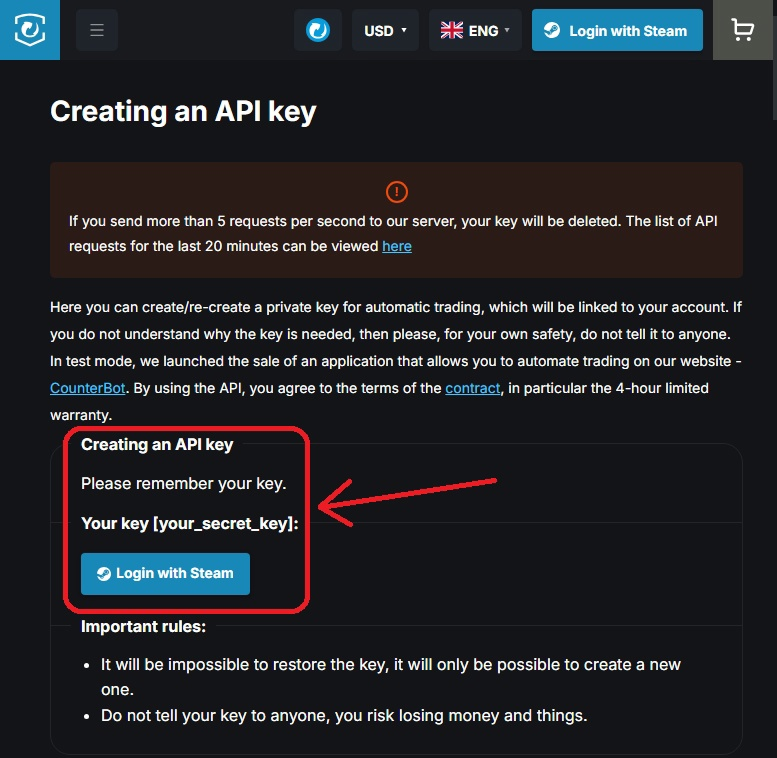
</div>

Добавленный ключ **автоматически** привязывается к соответствующему ключу Lis-Skins, что позволяет **легко связать работу по автопокупке и автопродаже**, превращая их в единый цикл. В данном случае бот также учитывает ситуации, при которых пользователь не забрал предмет или отсутствует в инвентаре по каким-либо другим причинам.

**Удаление ключа Market.CS возможно только при удалении ключа Lis-Skins**, поскольку он к нему привязан. Данный аспект важен в рамках реализации, поэтому добавляйте ключ внимательно.

## КАК РАБОТАЕТ ПАРСЕР

Приложение анализирует цены на внутриигровые предметы с разных торговых площадок, чтобы найти выгодные предложения для покупки и продажи. Он собирает информацию о цене предмета, его популярности, а также рассчитывает, насколько выгодно его продавать, учитывая текущие цены на разных платформах. Если цена предмета и его популярность говорят о том, что его можно продать с прибылью, парсер добавляет этот предмет в очередь и отправляет уведомление в Telegram.

Вот как это работает:
1. Сначала парсер **получает цену и другие данные о предмете** с разных торговых сайтов.
2. Затем приложение **вычисляет разницу в ценах и прогнозирует**, насколько выгодно продавать предмет.
3. На основе полученных данных **парсер выбирает самые выгодные предложения**.
4. Если предмет выгоден для покупки и продажи, парсер **отправляет уведомление в Telegram**, чтобы пользователи могли принять решение о сделке.
5. Если коэффициент прибыли достаточно высокий, **парсер сразу же отправляет предложение в канал**, чтобы информировать всех участников, что сделка может быть выгодной.

Опубликованный пост содержит в себе все самое необходимое для анализа предмета: Стикеры на предмете, Lis-Skins и Market.CSGO цены, цена автопокупки на Market.CSGO и средняя цена там же. Кроме этого **вы будете знать риск** позиции, при ее покупке, а также знать, **насколько предмет популярен на рынке**.

<div style="text-align: center;">
  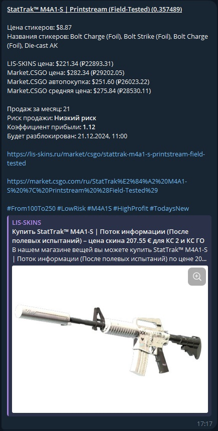
</div>

Для удобства работы, реализована система тегов, позволяющая пользователю отсортировать сообщения в телеграмм по нужным ему критериям, а именно:

### По уровню риска

- Высокий риск: **#HighRisk**
- Средний риск: **#MediumRisk**
- Низкий риск: **#LowRisk**

### По ценовым категориям

- Менее 100: **#Below100**
- От 100 до 250: **#From100To250**
- От 250 до 500: **#From250To500**
- От 500 до 1000: **#From500To1000**
- От 1000 до 2500: **#From1000To2500**
- Более 2500: **#Above2500**

### По типам оружия

В зависимости от разновидности оружия, используются теги по конкретным типам, например:

- **#Karambit**
- **#M9Bayonet**
- **#ButterflyKnife** и **т.п.**

Если оружие не входит в известный список, используется тег: **#Other.**

### По уровню прибыли

В зависимости от коэффициента прибыли p:

- Высокая прибыль: **#HighProfit** (если p >= 1.15)
- Средняя прибыль: **#MediumProfit** (если p >= 1.10)
- Низкая прибыль: **#LowProfit** (если p < 1.10)

### По повторяемости предметов

В зависимости от того, было ли предложение замечено ранее в течение дня:

- Если предмет уже встречался сегодня: **#TodaysDuplicate**
- Если предмет новый: **#TodaysNew**

Использование этих инструментов позволяет идеально подобрать те предметы, которые вам нужны для успешной реализации вашей торговой стратегии!

## ФИНАЛЬНАЯ АКТИВАЦИЯ
После настройки параметров выполните команды для запуска и остановки бота:

- Запустить автопокупку: `/start_autobuy`
- Остановить автопокупку: `/stop_autobuy`
- Запустить автопродажу: `/start_autosell`
- Остановить автопродажу: `/stop_autosell`

Следуя этим инструкциям, вы сможете удобно настроить автоматическую покупку предметов с учетом фильтров под ваши предпочтения.

> Жизнь — это маленькая кухня, на которой мы готовим блюда под названием "счастье". На этой кухне мы сами себе шеф-повара, и только нам решать, какие ингредиенты мы будем добавлять в наши блюда. Важно помнить, что универсального рецепта нет, поэтому пробуйте и тогда, в конце, вас будет ждать награда.
(С) Поль Бокюз
---
## 📬 Контакты
- Разработчик
  - Telegram: [@a_matisse](http://www.t.me/a_matisse)
- Приобретение подписки
  - Telegram: [@MrTwisterService](http://www.t.me/MrTwisterService)
